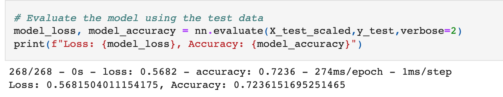
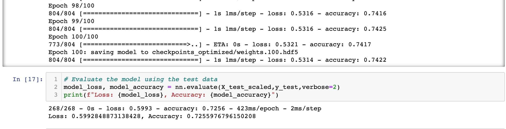
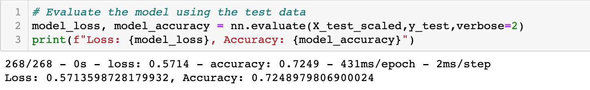
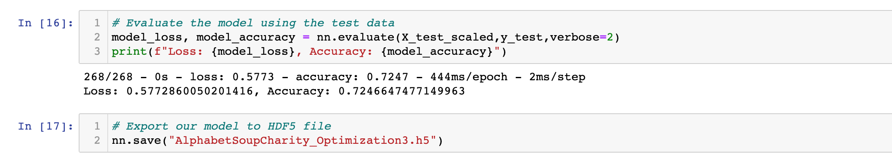

# Neural_Network_Charity_Analysis

# **Purpose**
The non-profit Alphabet soup has raised millions over the years which they donate to certain charities. However, these donations are not always used in an impactful way. The purpose of this project was to help the foundation predict where to make investments. Using machine learning and neural networks, a dataset  containing 34,000 organizations who received funding from Alphabet Soup was analyzed with a binary classifier that predicts whether applicants will be successful if given funding.

## **Goal**
- Preprocessing Data for a Neural Network Model
- Compile, Train, and Evaluate the Model
- Deliverable 3: Optimize the Model
- Deliverable 4: A Written Report on the Neural Network Model (README.md)

## **Resources**
- Dataset: charity_data.csv
- Software: Pandas, scikit-learn, Neural Networks, Machine Learning, Jupyter Notebook, Python, TensorFlow

## **Results**
The data was first preprocessed for the neural network model. The data was cleaned, unwanted features were dropped, certain features unique values were binned, and categorical values were encoded. Using Pandas and Scikit-Learn, the cleaned data was transformed into a new scaled dataframe. The target and features were extracted from the dataset.

Data Preprocessing
- *What variable(s) are considered the target(s) for your model?* In this model, the target was “Is successful”. The goal was to determine if an investment in a charity would have a positive impact.
- *What variable(s) are considered to be the features for your model?* All other columns excluding the dropped and target variable were considered usable features.
- *What variable(s) are neither targets nor features, and should be removed from the input data?* The non feature columns that were dropped were “EIN” and “NAME” both Identification columns.

A neural network was designed with TensorFlow to create a binary classification model that can predict if an investment will be successful based on the features in the dataset. The binary classification model was compiled, trained, and evaluated to calculate the model’s loss and accuracy.

The model was optimized to try to achieve a target predictive accuracy higher than 75%. 3 attempts were made to reach this target variable by adjusting the model.

Original model results:

 

First Optimized model results:

Second Optimized mode results:

Third Optimized model results:

Compiling, Training, and Evaluating the Model
- *How many neurons, layers, and activation functions did you select for your neural network model, and why?* In the initial model, there were two layers, the first with 80 neurons and the second with 30. In the first optimized version the layers and number of neurons were increased to increase the model’s efficiency and pick up on smaller details.
- *Were you able to achieve the target model performance?* In both the original model and the optimized models, the target performance was not reached; however, with every version, the accuracy was higher than the original with the first optimized version being the highest. The accuracy score of the original model was 72.3%. The accuracy score or the optimized, second optimized and third optimized models in order are 72.6%, 72.5% 72.5%.
- *What steps did you take to try and increase model performance?* In the first optimized version, a third hidden layer was added and the number of neurons was increased. In the second optimized model, the activation function was changed from Rulu to Sigmoid. In the last and third optimized model, the sizing of the feature binning was increased. 

## Summary
Overall, the first optimization was best with a score of 72.6%. The model could continue to be optimized by eliminating outliers, dropping more features, and trying different activation functions and different hidden layers. The random forest model should be explored to solve this classification problem because its multiple decision trees are excellent at both regression and classification handling. In this model, outliers get aggregated out and it has low risk of overfitting.
